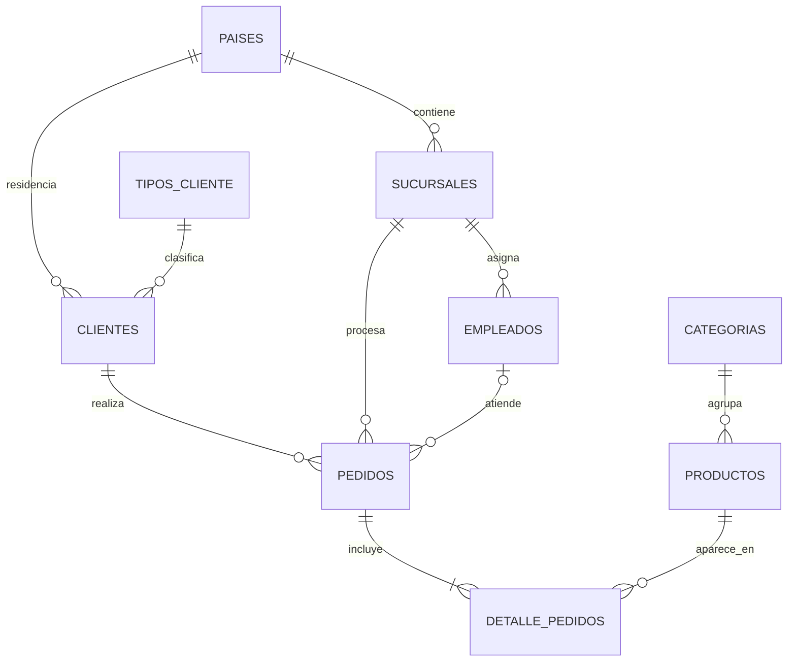

# Proyecto Capstone: EDA de una tienda latinoamericana con PostgreSQL

Este proyecto simula el trabajo de un analista de datos de principio a fin: configura una base PostgreSQL, carga un modelo relacional de ventas, controla su calidad, transforma los datos con reglas explícitas y responde preguntas de negocio mediante SQL.

## Problema de negocio

La dirección de una tienda con presencia en distintos países de Latinoamérica necesita una lectura confiable de su operación comercial. El objetivo es responder cinco preguntas:

1. ¿Quiénes son los cinco clientes con mayor gasto realizado?
2. ¿Cómo evolucionan las ventas por mes?
3. ¿Cuáles son los tres productos menos vendidos?
4. ¿Qué pedidos lideran el ingreso dentro de cada categoría?
5. ¿Qué sucursales generan más ventas?

La respuesta debe excluir operaciones que todavía no representan ingreso confirmado. Por eso se consideran **ventas realizadas** los pedidos con estado `Completado` o `Enviado`; se excluyen `Cancelado` y `En proceso`.

> Los importes se presentan en unidades monetarias (u.m.) porque la fuente no especifica una moneda única.

## Archivos del repositorio

| Archivo | Contenido |
|---|---|
| `estructura.sql` | Creación idempotente de `capstone_project`, tablas, restricciones, 1.020 registros de datos, índices y control final de carga. |
| `analisis.sql` | Diagnóstico, limpieza con `COALESCE`, vista analítica y cinco consultas de negocio comentadas. |
| `README.md` | Contexto, decisiones, hallazgos interpretados y pasos de ejecución. |

## Dataset y modelo

Se reutiliza la base `tienda` trabajada durante el curso y se la adapta al nombre obligatorio `capstone_project`. La carga contiene:

| Tabla | Filas | Función en el modelo |
|---|---:|---|
| `paises` | 12 | País y continente. |
| `categorias` | 8 | Clasificación de productos. |
| `tipos_cliente` | 4 | Segmentación comercial. |
| `sucursales` | 20 | Puntos de venta. |
| `empleados` | 40 | Personal asignado a sucursales. |
| `clientes` | 100 | Personas que realizan pedidos. |
| `productos` | 39 | Catálogo, precio y stock. |
| `pedidos` | 200 | Cabecera, fecha, estado y total del pedido. |
| `detalle_pedidos` | 597 | Productos, cantidades y precios de cada pedido. |

En total se cargan **1.020 filas**. El período de los pedidos va de enero de 2023 a diciembre de 2024.




## Limpieza y decisiones de calidad

La limpieza se ejecuta antes de las consultas finales y deja evidencia reproducible:

- Se cuentan nulos en `fecha_pedido`, `total`, `precio`, `precio_unitario`, `cantidad` y `subtotal`. El dataset actual devuelve **cero nulos en todos los campos críticos**.
- Se consulta `information_schema.columns` para verificar que las fechas sean `DATE`/`TIMESTAMP` y los importes `NUMERIC`/`DECIMAL`, no texto.
- Se compara el total de los 200 pedidos con la suma de sus líneas. El resultado es **cero diferencias**, incluso con una tolerancia de un centavo.
- Se crea `vw_ventas_limpias`. La vista usa `COALESCE` de manera defensiva: precio de catálogo como respaldo del precio de venta, fecha de registro como respaldo temporal, cero para medidas faltantes y una etiqueta para pedidos sin empleado.
- Los `LEFT JOIN` del análisis de baja rotación conservan los productos sin ventas; si existieran, se mostrarían con cero unidades en lugar de desaparecer.
- La estructura incluye `PRIMARY KEY`, `FOREIGN KEY`, `UNIQUE`, `CHECK`, tipos correctos y diez índices para claves de unión y filtros frecuentes.

No se imputan valores sobre la tabla original porque las columnas críticas ya están completas. La capa limpia protege el análisis ante futuras cargas sin modificar la fuente.

## Hallazgos principales

### 1. Panorama comercial

De 200 pedidos, **154 son ventas realizadas** (77 %): 124 completados y 30 enviados. Esas ventas suman **259.787,90 u.m.** Los 25 cancelados representan 27.797,70 u.m. potenciales perdidas y los 21 pedidos en proceso, 31.758,76 u.m. todavía no confirmadas.

Interpretación: el ingreso confirmado debe calcularse por estado. Sumar todos los pedidos inflaría la facturación en 59.556,46 u.m., un 22,9 % adicional sobre la venta realizada.

### 2. Top 5 clientes por gasto

| Posición | Cliente | Pedidos realizados | Gasto total | Ticket promedio |
|---:|---|---:|---:|---:|
| 1 | Verónica Torres | 3 | 21.945,47 | 7.315,16 |
| 2 | Claudia Rodríguez | 4 | 12.616,07 | 3.154,02 |
| 3 | Benjamín Reyes | 2 | 12.284,04 | 6.142,02 |
| 4 | Horacio Ramírez | 1 | 9.319,22 | 9.319,22 |
| 5 | Rodrigo Morales | 3 | 8.742,47 | 2.914,16 |

Los cinco clientes aportan **64.907,27 u.m.**, el **24,98 %** de las ventas realizadas. El liderazgo no depende solo de la frecuencia: Horacio Ramírez alcanza el cuarto lugar con una única compra de alto valor.

Acción sugerida: diseñar beneficios de retención para los cinco clientes, diferenciando compradores frecuentes de clientes de ticket extraordinario.

### 3. Evolución mensual

| Indicador | Resultado |
|---|---:|
| Ventas 2023 | 127.352,84 |
| Ventas 2024 | 132.435,06 |
| Crecimiento anual 2024 vs. 2023 | 3,99 % |
| Mejor mes | 2024-02: 28.764,32 |
| Segundo mejor mes | 2023-11: 22.125,34 |
| Mes de menor venta | 2024-04: 1.376,78 |

La facturación anual crece, pero la serie mensual es volátil. Febrero de 2024 concentra un pico que no se sostiene en marzo y abril. La consulta incluye `LAG()` para medir cada variación mensual y facilitar la detección de estas rupturas.

Acción sugerida: investigar campañas, surtido y pedidos de alto valor de febrero de 2024; no conviene interpretar el 3,99 % anual sin explicar la irregularidad mensual.

### 4. Productos de menor rotación

| Producto | Categoría | Unidades | Ingreso generado |
|---|---|---:|---:|
| Remera Polo Ralph Lauren | Ropa y Calzado | 11 | 895,32 |
| Pelota Fútbol Adidas Pro | Deportes y Outdoors | 16 | 965,95 |
| Juego de Mesa Catan | Juguetes y Entretenimiento | 17 | 931,10 |

La remera es el producto con menor volumen. Pelota Adidas y Catan tienen volúmenes similares, por lo que el ingreso complementa la lectura de unidades. En el dataset no hay productos con cero ventas, pero el SQL está preparado para detectarlos.

Acción sugerida: revisar precio, exhibición y promociones de estos artículos antes de reponerlos; una baja rotación con stock elevado aumenta el costo de inventario.

### 5. Ranking de pedidos por categoría

`RANK()` se aplica dentro de cada categoría sobre el importe que cada pedido aporta a ella. Los líderes son:

| Categoría | Pedido | Fecha | Cliente | Importe en la categoría |
|---|---:|---|---|---:|
| Electrónica | 85 | 2023-11-08 | Verónica Torres | 10.721,06 |
| Ropa y Calzado | 84 | 2023-11-20 | Rodrigo Morales | 1.295,70 |
| Hogar y Decoración | 86 | 2023-10-07 | Catalina Vargas | 2.509,92 |
| Alimentación | 199 | 2024-01-12 | Catalina Vargas | 173,41 |
| Deportes y Outdoors | 102 | 2023-07-07 | Facundo Ortiz | 3.758,80 |
| Libros y Educación | 196 | 2023-01-05 | Gabriela Cruz | 243,32 |
| Belleza y Cuidado Personal | 47 | 2023-09-10 | Martín García | 605,80 |
| Juguetes y Entretenimiento | 193 | 2024-10-19 | Tomás Díaz | 462,26 |

Electrónica presenta una escala muy superior: su pedido líder es más de cuatro veces el líder de Hogar. Esto advierte que comparar montos absolutos entre categorías puede ocultar diferencias de precio; el ranking particionado permite evaluar cada categoría dentro de su propia escala.

### 6. Rendimiento de sucursales

| Posición | Sucursal | Pedidos | Clientes | Ventas | Ticket promedio |
|---:|---|---:|---:|---:|---:|
| 1 | Sucursal Buenos Aires Centro | 16 | 15 | 32.136,01 | 2.008,50 |
| 2 | Sucursal Quito | 11 | 10 | 29.578,36 | 2.688,94 |
| 3 | Sucursal Ciudad de Panamá | 12 | 11 | 28.077,85 | 2.339,82 |
| 4 | Sucursal Lima San Isidro | 12 | 10 | 26.479,28 | 2.206,61 |
| 5 | Sucursal Lima Miraflores | 13 | 13 | 23.622,07 | 1.817,08 |

Las cinco sucursales concentran **53,85 %** de la venta realizada. Buenos Aires Centro lidera por volumen e ingreso, mientras Quito alcanza el mayor ticket promedio dentro del top cinco.

Acción sugerida: usar Buenos Aires Centro como referencia de volumen y estudiar la mezcla de productos de Quito para entender su ticket superior.

## Cómo ejecutar el proyecto

### Requisitos

- PostgreSQL 12 o superior.
- Un usuario con permiso para crear bases de datos.
- Codificación UTF-8.
- `psql`, pgAdmin 4 o DBeaver.

### Opción A: terminal con `psql`

Ubicarse en la carpeta del repositorio y ejecutar en una de las terminales que uses:

```bash
psql -U postgres -d postgres -p 5433 -f estructura.sql
psql -U postgres -d capstone_project -p 5433 -f analisis.sql
```

`estructura.sql` usa `\gexec` y `\connect`, comandos oficiales de `psql`, para crear `capstone_project` solo si no existe y conectarse automáticamente.

### Opción B: pgAdmin o DBeaver

1. Conectarse a una base administrativa, por ejemplo `postgres`.
2. Crear la base una sola vez:

   ```sql
   CREATE DATABASE capstone_project;
   ```

3. Abrir una nueva conexión o Query Tool sobre `capstone_project`.
4. En `estructura.sql`, ejecutar desde la sección `CONFIGURACION DE LA SESION` hasta el final. No ejecutar en la interfaz las líneas de `psql` que comienzan con `\`.
5. Confirmar que el control de carga devuelva los nueve conteos esperados.
6. Ejecutar `analisis.sql` completo sobre `capstone_project`.
7. Leer cada resultado junto con el comentario que explica su propósito de negocio.

> Advertencia: al volver a ejecutar la parte estructural se eliminan y reconstruyen las nueve tablas dentro de `capstone_project`. No usarla sobre una base con cambios que se quieran conservar.

## Cómo publicar la entrega en GitHub

Crear un repositorio **público** vacío y, desde esta carpeta, ejecutar:

```bash
git init
git add estructura.sql analisis.sql README.md
git commit -m "Entrega proyecto final SQL PostgreSQL"
git branch -M main
```

Después, copiar desde el repositorio recién creado los dos comandos que GitHub muestra para agregar el remoto `origin` y publicar la rama `main`. Antes de entregar, comprobar que en la raíz se vean exactamente los tres archivos requeridos y que el diagrama Mermaid del README se renderice correctamente.


## Matriz de cumplimiento

| Requisito del módulo 8 | Evidencia |
|---|---|
| Base `capstone_project` | Bloque inicial de `estructura.sql`. |
| Creación e inserción | Nueve tablas, restricciones y 1.020 filas en `estructura.sql`. |
| Nulos y `COALESCE` | Sección 1 de `analisis.sql` y `vw_ventas_limpias`. |
| Tipos `DATE` y `NUMERIC` | DDL y consulta a `information_schema.columns`. |
| Top 5 clientes | Pregunta 1 con `JOIN`, `GROUP BY` y `SUM`. |
| Ventas por mes | Pregunta 2 con `DATE_TRUNC` y `LAG`. |
| 3 productos menos vendidos | Pregunta 3 con `LEFT JOIN`, `FILTER` y `COALESCE`. |
| Ranking por categoría | Pregunta 4 con CTE y `RANK() OVER (PARTITION BY ...)`. |
| Quinta pregunta compleja | Pregunta 5: rendimiento de sucursales. |
| Función avanzada adicional | `CASE` y función de ventana en el control gerencial. |
| Consultas comentadas | Cada bloque explica por qué se calcula el indicador. |
| Conclusiones interpretadas | Sección de hallazgos y acciones sugeridas. |

## Limitaciones

- El dataset es educativo; los hallazgos demuestran el método analítico y no describen una empresa real.
- No se especifica moneda, impuestos ni devoluciones. Los importes no deben interpretarse como estados contables.
- La definición de venta realizada (`Completado` + `Enviado`) es una decisión analítica explícita y puede ajustarse si el negocio reconoce el ingreso en otro momento.
- Dos años de datos alcanzan para comparar 2023 y 2024, pero no para afirmar estacionalidad de largo plazo.
